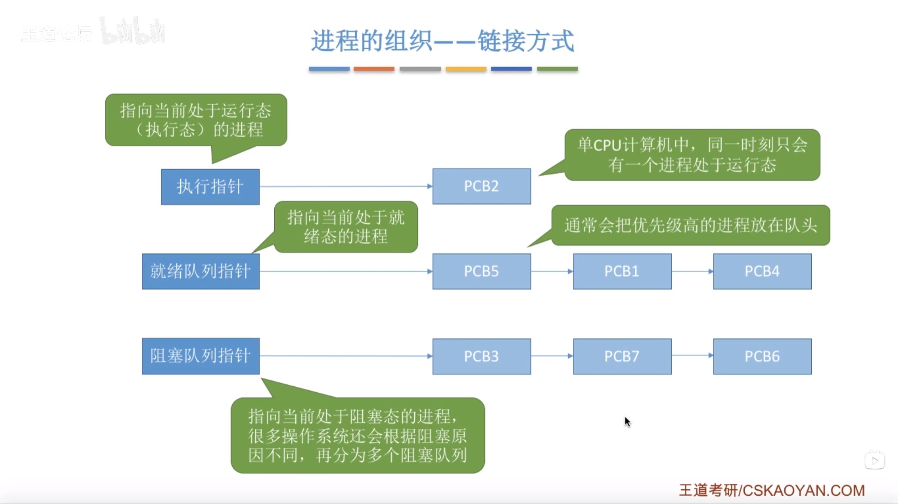
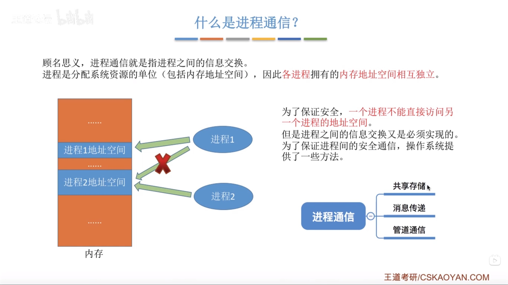
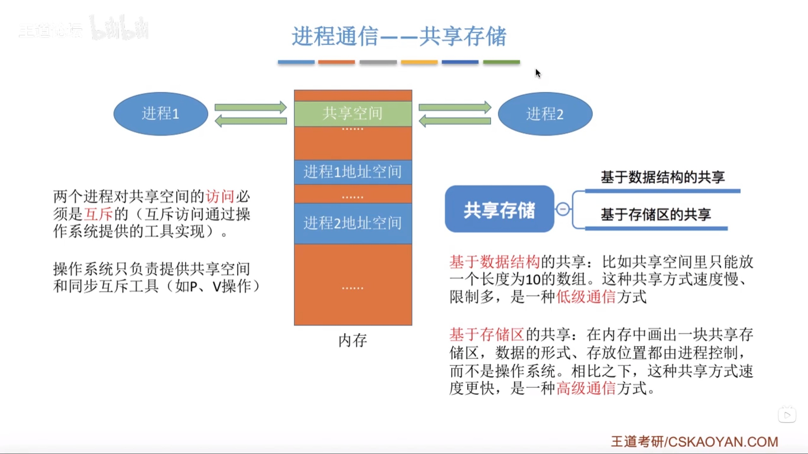
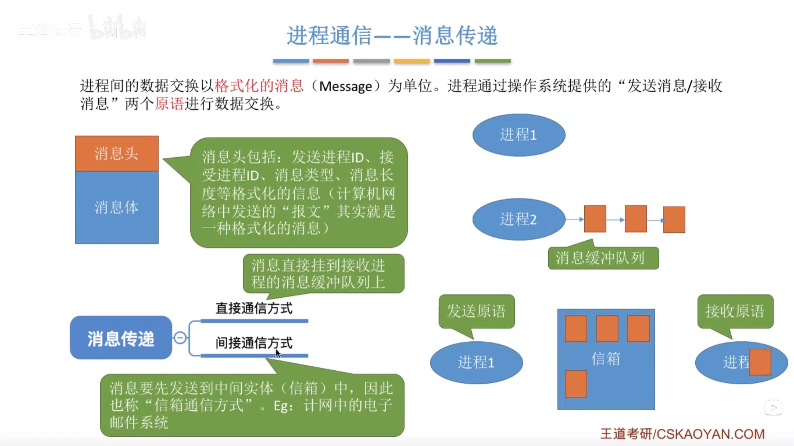
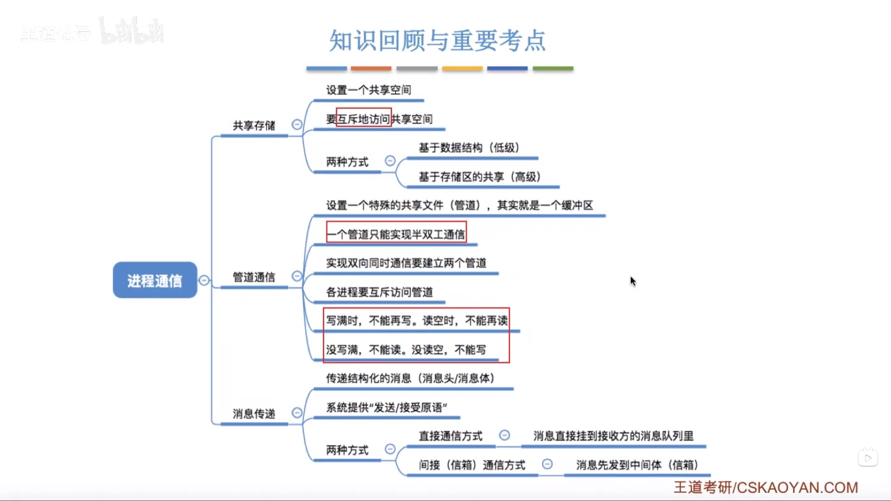
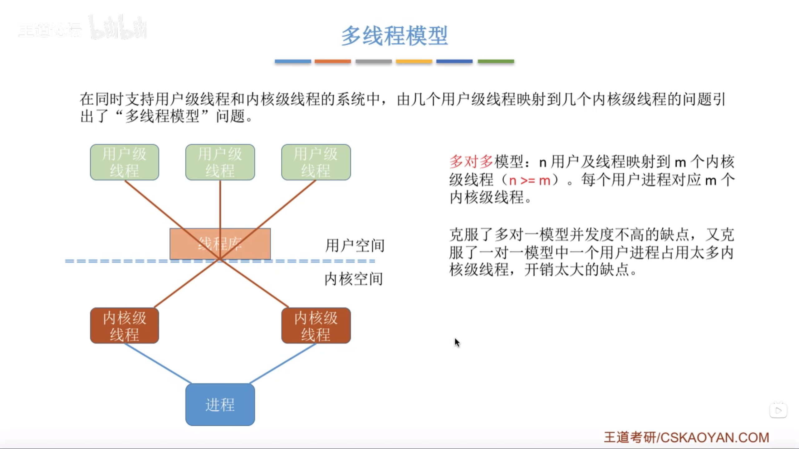

# 进程管理

## 1. 进程的定义

- 定义：在计算机发展史上，“进程"是为了解决什么问题而被引入的？
- 组成：每个进程由哪些部分组成？
- 组织方式：系统中各个进程之间是如何被组织起来的？
- 特征：相比于程序，进程有哪些特征？

引入**多道程序技术**之后：为了方便操作系统管理，完成各程序并发执行，引入了**进程**、**进程实体**的概念。

内存中同时放入多道程序，各个程序的代码、运算数据存放的位置不同。操作系统要怎么才能找到各程序的存放位置呢？

系统为每个运行的程序配置一个数据结构，称为**进程控制块**（**PCB**），用来描述进程的各种信息（如程序代码存放位置）

**PCB、程序段、数据段**三部分构戚了**进程实体**（**进程映像**）。

一般情况下，我们把进程实体就简称为进程，例如，所谓创建进程，实质上是创建进程实体中的 PCB；而撤销进程，实质上是撤销进程实体中的 PCB。

> 注意：**PCB 是进程存在的唯一标志！**

从不同的角度，进程可以有不同的定义，比较传统典型的定义有：

1. 进程是程序的一次**执行过程**。
2. 进程是一个程序及其数据在处理机上顺序执行时所**发生的活动**。
3. 进程是具有独立功能的程序在数据集合上**运行的过程**，它是系统进行资源分配和调度的一个独立单位.

> 强调“**动态性**”。

引入进程实体的概念后，可把进程定义为：

**进程**是进程实体的**运行过程**，是操作系统**进行资源分配和调度的一个独立单位**。

> 注意：严格来说，进程实体和进程并不一样，**进程实体是静态的**，**进程则是动态的**。
> 不过，除非题目专门考察二者区别，否则可以认为进程实体就是进程。
> 因此我们也可以说“进程由程序段、数据段、PCB 三部分组成”。

## 2. 进程的组成

- PCB：操作系统通过 PCB 来管理进程，因此 PCB 中应该包含操作系统对其进行管理所需的各种信息
- 程序段：程序代码即存放在此
- 数据段：程序运行时使用、产生的运算数据。如全局变量、局部变量、宏定义的常量就存放在数据段内

PCB 的组成：

- 进程描述信息
  - 进程标识符 PID
  - 用户标识符 UID
- 进程控制和管理信息
  - 进程当前状态
  - 进程优先级
- 资源分配清单
  - 程序段指针
  - 数据段指针
  - 键盘
  - 鼠标
- 处理机相关信息
  - 各种寄存器值

> 当进程切换时需要把进程当前的运行情况记录下来保存在 PCB 中，如程序计数器的值表示了当前程序执行到哪一句。

PCB 的组成（另一种说法）：

- 进程标识符
- 处理机状态
- 进程调度信息
- 进程控制信息

进程的组成：

- PCB：进程的管理者（操作系统）所需的数据都在 PCB 中
  - 进程描述信息
  - 进程控制和管理信息
  - 资源分配清单
  - 处理机相关信息
- 程序段：存放要执行的代码
- 数据段：存放程序运行过程中处理的各种数据

## 3. 进程的组织

在一个系统中，通常有数十、数百乃至数千个 PCB。为了能对他们加以有效的管理，应该用适当的方式把这些 PCB 组织起来。

> 注意：进程的组成讨论的是一个进程内部由哪些部分构成的问题，而进程的组织讨论的是多个进程之间的组织方式问题。

进程的组织方式：

- 链接方式
  - 按照进程状态将 PCB 分为多个队列
  - 操作系统持有指向各个队列的指针
- 索引方式
  - 根据进程状态的不同，建立几张索引表
  - 操作系统持有指向各个索引表的指针

### 3.1. 链接方式

### 3.2. 索引方式

## 4. 进程的特征

- **动态性**：进程是程序的一次执行过程，是动态地产生、变化和消亡的
- 并发性：内存中有多个进程实体，各进程可并发执行
- 独立性：进程是能独立运行、独立获得资源、独立接受调度的基本单位
- 异步性：各进程按各自独立的、不可预知的速度向前推进，操作系统要提供“进程同步机制"来解决异步问题
- 结构性：每个进程都会配置一个 PCB。结构上看，进程由程序段、数据段、PCB 组成

> 注意：
> **动态性**是进程最基本的特征。
> **独立性**是指进程是操作系统进行资源分配和调度的一个独立单位。
> **异步性**有可能会导致并发程序执行结果的不确定性。

## 5. 进程的状态与转换

进程的状态：

- 运行状态
- 就绪状态
- 阻塞状态
- 创建状态
- 终止状态

进程状态间的转换：

- 就绪态 -> 运行态 : 获得处理机资源，进程被调度
- 运行态 -> 就绪态 ：时间片到，或处理机被抢占
- 运行态 -> 阻塞态 ：系统调用（进程主动行为）
- 阻塞态 -> 就绪态 ：申请的资源被分配，或等待的事件发生（进程被动行为）

进程是程序的一次执行。在这个执行过程中，有时进程正在被 CPU 处理，有时又需要等待 CPU 服务，可见，进程的状态是会有各种变化。为了方便对各个进程的管理，操作系统需要将进程合理地划分为几种状态。

进程的**三种基本状态**：

- **运行态**（Running）：占有 CPU，并在 CPU 上运行
  - 单核处理机环境下，每时刻最多只有一个进程处于运行态
  - 双核环境下可以同时有两个进程处于运行态
- **就绪态**（Ready）：已经具备运行条件，但由于没有空闲 CPU，而暂时不能运行
  - 进程已经拥有了除处理机之外所有需要的资源，一旦获得处理机，即可立即进入运行态开始运行
  - 即：万事俱备，只欠 CPU
- **阻塞态**（Waiting / Blocked，又称：等待态）：因等待某一事件而暂时不能运行
  - 如：等待操作系统分配打印机、等待读磁盘操作的结果
  - CPU 是计算机中最昂贵的部件，为了提高 CPU 的利用率，需要先将其他进程需要的资源分配到位，才能得到 CPU 的服务

进程的另外两种状态：

- 创建态（New，又称：新建态）：进程正在被创建，操作系统为进程分配资源、初始化 PCB
- 终止态（Terminated，又称：结束态）：进程正在从系统中撒销，操作系统会回收进程拥有的资源、撤销 PCB

## 6. 进程控制

基本概念：

- 什么是进程控制
- 如何实现进程控制：用“原语”实现

进程控制相关的原语：

- 进程的创建
- 进程的终止
- 进程的阻塞
- 进程的唤醒
- 进程的切换

### 6.1. 进程控制

进程控制的主要功能是对系统中的所有进程实施有效的管理，它具有创建新进程、撤销已有进程、实现进程状态转换等功能。

简化理解：反正**进程控制就是要实现进程状态转换**。

用**原语**实现进程控制。**原语的特点是执行期间不允许中断**，只能一气呵成。

这种不可被中断的操作即**原子操作**。

原语采用“**关中断指令**”和“**开中断指令**”实现

显然，关/开中断指令的权限非常大，必然是只允许在核心态下执行的特权指令

### 6.2. 进程控制相关的原语

学习技巧：进程控制会导致进程状态的转换。无论哪个原语，要做的无非三类事情：

1. 更新 PCB 中的信息（如修改进程状态标志、将运行环境保存到 PCB、从 PCB 恢复运行环境）
   1. 所有的进程控制原语一定都会修改进程状态标志
   2. 剥夺当前运行进程的 CPU 使用权必然需要保存其运行环境
   3. 某进程开始运行前必然要恢复期运行环境
2. 将 PCB 插入合适的队列
3. 分配 / 回收资源

#### 6.2.1. 进程的创建

$$
无 \rightarrow 创建态 \rightarrow 就绪态
$$

创建原语：

- 申请空白 PCB
- 为新进程分配所需资源
- 初始化 PCB
- 将 PCB 插入就绪队列

引起进程创建的事件：

- 用户登录：分时系统中，用户登录成功，系统会建立为其建立一个新的进程决
- 作业调度：多道批处理系统中，有新的作业放入内存时，会为其建立一个新的进程
- 提供服务：用户向操作系统提出某些请求时，会新建一个进程处理该请求
- 应用请求：由用户进程主动请求创建一个子进程

#### 6.2.2. 进程的终止

$$
就绪态/阻塞态/运行态 \rightarrow 终止态 \rightarrow 无
$$

撤销原语：

- 从 PCB 集合中找到终止进程的 PCB
- 若进程正在运行，立即剥夺 CPU，将 CPU 分配给其他进程
- 终止其所有子进程
- 将该进程拥有的所有资源归还给父进程或操作系统
- 删除 PCB

引起进程终止的事件：

- 正常结束
- 异常结束
- 外界干预

#### 6.2.3. 进程的阻塞

$$
运行态 \rightarrow 阻塞态
$$

阻塞原语：

- 找到要阻塞的进程对应的 PCB
- 保护进程运行现场，将 PCB 状态信息设置为“阻塞态"，暂时停止进程运行
- 将 PCB 插入相应事件的等待队列

引起进程阻塞的事件：

- 需要等待系统分配某种资源
- 需要等待相互合作的其他进程完成工作

#### 6.2.4. 进程的唤醒

$$
阻塞态 \rightarrow 就绪态
$$

唤醒原语：

- 在事件等待队列中找到 PCB
- 将 PCB 从等待队列移除，设置进程为就绪态
- 将 PCB 插入就绪队列，等待被调度

引起进程唤醒的事件：

- 等待事件的发生

> 注意：阻塞原语、唤醒原语必须成对使用。因何事阻塞，就应由何事唤醒。

#### 6.2.5. 进程的切换

$$
就绪态 \rightarrow 运行态
$$

$$
运行态 \rightarrow 就绪态 / 阻塞态
$$

切换原语：

- 将运行环境信息存入 PCB
- PCB 移入相应队列
- 选择另一个进程执行，并更新其 PCB
- 根据 PCB 恢复新进程所需的运行环境

引起进程切换的事件：

- 当前进程时间片到
- 有更高优先级的进程到达
- 当前进程主动阻塞
- 当前进程终止

## 7. 进程通信

- 共享存储
  - 基于数据结构的共享
  - 基于存储区的共享
- 消息传递
  - 直接通信方式
  - 间接通信方式
- 管道通信

顾名思义，进程通信就是指进程之间的信息交换进程是分配系统资源的单位（包括内存地址空间），因此**各进程**拥有的**内存地址空间相互独立**。

为了保证安全，一个进程不能直接访问另个进程的地址空间。

但是进程之间的信息交换又是必须实现的。

为了保证进程间的安全通信，操作系统提供了一些方法。

### 7.1. 共享存储

两个进程对共享空间的访问必须是互斥的（互斥访问通过操作系统提供的工具实现）。

操作系统只负责提供共享空间和同步互斥工具（如 P、V 操作）。

**基于数据结构**的共享：比如共享空间里只能放个长度为 10 的数组。这种共享方式速度慢、限制多，是一种**低级通信**方式。

**基于存储区**的共享：在内存中画出一块共享存储区，数据的形式、存放位置都由进程控制，而不是操作系统。相比之下，这种共享方式速度更快，是一种**高级通信**方式。

### 7.2. 管道通信

“管道”是指用于连接读写进程的一个共享文件，又名 pipe 文件。其实就是在内存中开辟个大小固定的缓冲区。

1. 管道只能采用**半双工通信**，某一时间段内只能实现单向的传输。如果要实现**双向同时通信**，则**需要设置两个管道**。
2. 各进程要**互斥**地访问管道。
3. 数据以字符流的形式写入管道，当**管道写满**时，**写进程**的 write() 系统调用将被**阻塞**，等待读进程将数据取走。当读进程将数据全部取走后，**管道变空**，此时**读进程**的 read() 系统调用将被**阻塞**。
4. 如果**没写满，就不允许读**。如果**没读空，就不允许写**。
5. 数据一旦被读岀，就从管道中被抛拋弃，这就意味着**读进程最多只能有一个**，否则可能会有读错数据的情况。

### 7.3. 消息传递

进程间的数据交换以格式化的消息（Message）为单位。进程通过操作系统提供的“发送消息/接收消息”两个原语进行数据交换。

消息头包括：发送进程 ID、接受进程 ID、消息类型、消息长度等格式化的信息（计算机网络中发送的“报文”其实就是种格式化的消息）

- 直接通信方式：消息直接挂到接收进程的消息缓冲队列上
- 间接通信方式：消息要先发送到中间实体（信箱）中，因此也称“信箱通信方式”。Eg：计网中的电子邮件系统

## 8. 线程概念和多线程模型

- 什么是线程，为什么要引入线程？
- 引入线程机制后，有什么变化？
- 线程有哪些重要的属性？
- 线程的实现方式
  - 用户级线程
  - 内核级线程
- 多线程模型
  - 多对一模型
  - 一对一模型
  - 多对多模型

### 8.1. 线程

有的进程可能需要“同时”做很多事，而传统的进程只能串行地执行一系列程序。为此，引入了“线程”，来增加并发度。

- 传统的进程是程序执行流的最小单位
- 引入线程后，线程成为了程序执行流的最小单位

可以把线程理解为“轻量级进程”。

**线程**是一个**基本的 CPU 执行单元**，也是程序**执行流的最小单位**。

引入线程之后，不仅是进程之间可以并发，进程内的**各线程之间也可以并发**，从而进一步**提升了系统的并发度**，使得一个进程内也可以并发处理各种任务（如 QQ 视频、文字聊天、传文件）。

引入线程后，**进程**只作为**除 CPU 之外的系统资源的分配单元**（如打印机、内存地址空间等都是分配给进程的）。

### 8.2. 引入线程后的变化

- 资源分配、调度
  - 传统进程机制中，进程是资源分配、调度的基本单位
  - 引入线程后，进程是资源分配的基本单位，线程是调度的基本单位
- 并发性
  - 传统进程机制中，只能进程间并发
  - 引入线程后，各线程间也能并发，提升了并发度
- 系统开销
  - 传统的进程间并发，需要切换进程的运行环境，系统开销很大
  - 线程间并发，如果是同一进程内的线程切换，则不需要切换进程环境，系统开销小
  - 引入线程后，并发所带来的系统开销减小

### 8.3. 线程的属性

- 线程是处理机调度的单位
- 多 CPU 计算机中，各个线程可占用不同的 CPU
- 每个线程都有一个线程 ID、线程控制块（TCB）
- 线程也有就绪、阻塞、运行三种基本状态
- 线程几乎不拥有系统资源
- 同一进程的不同线程间共享进程的资源
- 由于共享内存地址空间，同一进程中的线程间通信甚至无需系统
- 干预同一进程中的线程切换，不会引起进程切换
- 不同进程中的线程切换，会引起进程切换
- 切换同进程内的线程，系统开销很小
- 切换进程，系统开销较大

### 8.4. 线程的实现方式

#### 8.4.1. 用户级线程

用户级线程（User-Level Thread，ULT）由应用程序通过线程库实现。

所有的**线程管理工作**都由**应用程序负责**（包括线程切换）。

用户级线程中，**线程切换**可以在**用户态下即可完成**，无需操作系统干预。

在用户看来，是有多个线程。但是在操作系统内核看来，并意识不到线程的存在。（**用户级线程对用户不透明，对操作系统透明**）

可以这样理解，“**用户级线程**”就是“**从用户视角看能看到的线程**”

#### 8.4.2. 内核级线程

内核级**线程的管理工作**由**操作系统内核**完成。

线程调度、切换等工作都由内核负责，因此**内核级线程的切换**必然需要在**核心态**下才能完成。

可以这样理解，“**内核级线程**”就是“**从操作系统内核视角看能看到的线程**”。

### 8.5. 多线程模型

在同时支持用户级线程和内核级线程的系统中，可采用二者组合的方式：将 n 个用户级线程映射到 m 个内核级线程上（n>=m）。

操作系统只“看得见”内核级线程，因此只有**内核级线程才是处理机分配的单位**。

#### 8.5.1. 多对一模型

多对一模型：多个用户及线程映射到一个内核级线程。每个用户进程只对应一个内核级线程。

优点：

- 用户级线程的切换在用户空间即可完成，不需要切换到核心态
- 线程管理的系统开销小，效率高

缺点：

- 当一个用户级线程被阻塞后，整个进程都会被阻塞，并发度不高
- 多个线程不可在多核处理机上并行运行

#### 8.5.2. 一对一模型

对一模型：一个用户及线程映射到一个内核级线程。每个用户进程有与用户级线程同数量的内核级线程。

优点：

- 当一个线程被阻塞后，别的线程还可以继续执行，并发能力强
- 多线程可在多核处理机上并行执行

缺点：

- 一个用户进程会占用多个内核级线程
- 线程切换由操作系统内核完成，需要切换到核心态
- 线程管理的成本高，开销大。

#### 8.5.3. 多对多模型

多对多模型：n 用户及线程映射到 m 个内核级线程（n>=m）。每个用户进程对应 m 个内核级线程。

克服了多对一模型并发度不高的缺点，又克服了一对一模型中一个用户进程占用太多内核级线程，开销太大的缺点。

